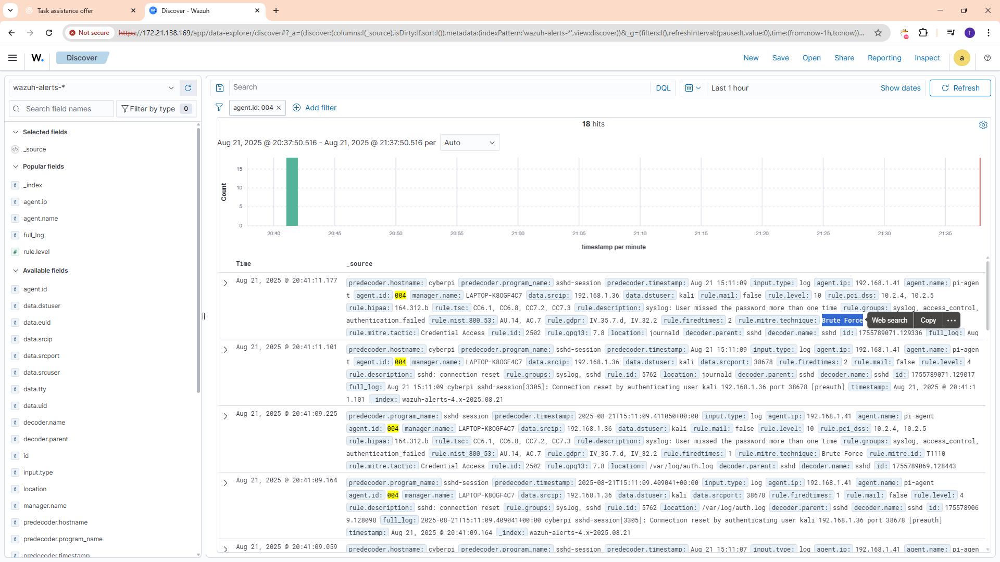

# Alert Triage Practice

This directory contains practical documentation and logs for SOC alert triage.

## Contents
- **SSH_Brute_Force_Triage.md** → Step-by-step triage workflow for SSH brute force alerts.
- **Triage_Log_Template.csv** → Template to log triage steps during incidents.
- **diagram/** → (Optional) Holds visual diagrams of triage workflows.

## Evidence

Below is the screenshot of the Wazuh alert for the SSH brute force attempt:

